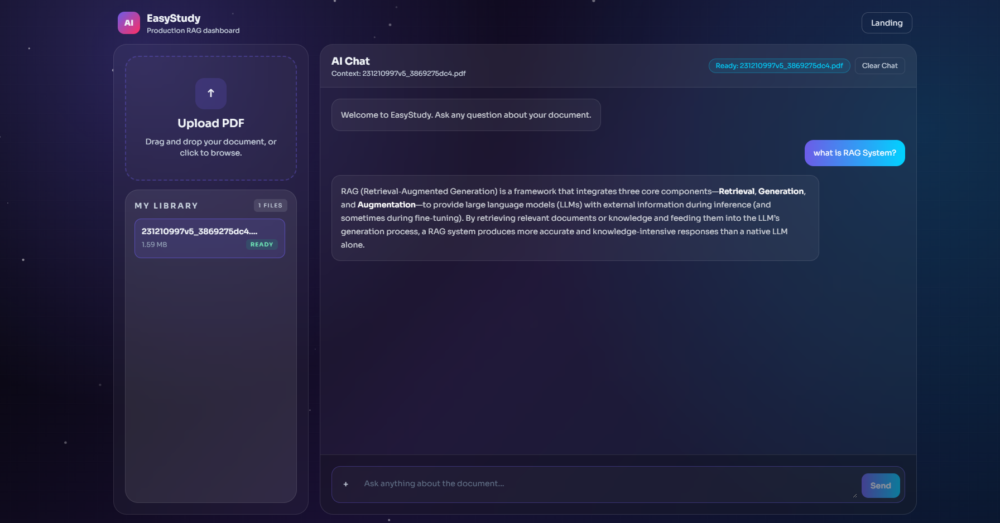

<div align="center">

# 📚 ChatWithPDF-RAG-System

**Ask questions about your PDFs and get accurate, context-grounded answers powered by RAG.**

[](https://python.org)
[](https://fastapi.tiangolo.com)
[](https://nextjs.org)
[](https://langchain.com)
[](https://github.com/facebookresearch/faiss)
[](https://docs.docker.com/compose)

</div>

---

## What is This?

EasyStudy is a full-stack **Retrieval-Augmented Generation (RAG)** application. Upload any PDF, and the system will:

1. **Extract & clean** the text from your document
2. **Split** it into smart, overlapping chunks
3. **Embed** each chunk into vector space
4. **Store** the vectors in a FAISS index for lightning-fast search
5. **Retrieve & rerank** the most relevant chunks when you ask a question
6. **Generate** a grounded answer using an LLM — based only on your document

No hallucinations. No guessing. Just answers backed by your own data.

---

## Demo

### Landing Page


### Chat Dashboard



---

## How the RAG Pipeline Works

This is the core of the project. Here's a deep dive into every stage:

```
              PDF Upload
                  │
                 ▼
┌─────────────────────────────────────────────┐
│          1. INGESTION PIPELINE              │
│                                             │
│  PDF ──► PyPDFLoader ──► Raw Documents      │
│              │                              │
│              ▼                              │
│  ┌─────────────────────────┐                │
│  │   Text Cleaning (15+    │                │
│  │   regex patterns)       │                │
│  │   • Remove HTML/MD      │                │
│  │   • Strip emojis        │                │
│  │   • Remove references   │                │
│  │   • Normalize unicode   │                │
│  └──────────┬──────────────┘                │
│             ▼                               │
│  ┌─────────────────────────┐                │
│  │  Recursive Chunking     │                │
│  │  • 800 tokens per chunk │                │
│  │  • 120 token overlap    │                │
│  │  • Smart separators:    │                │
│  │    ¶¶ → ¶ → . → space   │                │
│  └──────────┬──────────────┘                │
│             ▼                               │
│       Document Chunks + Metadata            │
└─────────────┬───────────────────────────────┘
              │
              ▼
┌─────────────────────────────────────────────┐
│         2. EMBEDDING & INDEXING             │
│                                             │
│  Chunks ──► Sentence-BERT ──► 384d Vectors  │
│          (all-MiniLM-L6-v2)                 │
│                    │                        │
│                    ▼                        │
│           FAISS Vector Index                │
│         (saved to disk for reuse)           │
└─────────────┬───────────────────────────────┘
              │
              │  User asks a question
              ▼
┌─────────────────────────────────────────────┐
│         3. RETRIEVAL & RERANKING            │
│                                             │
│  Query ──► Embed ──► FAISS Similarity Search│
│                          │                  │
│                    Top-K chunks (k=4)       │
│                          │                  │
│                          ▼                  │
│               ┌─────────────────┐           │
│               │ Lexical Reranker│           │
│               │  Token overlap  │           │
│               │  scoring        │           │
│               └────────┬────────┘           │
│                        │                    │
│                  Best N chunks              │
└────────────────────────┬────────────────────┘
                         │
                         ▼
┌─────────────────────────────────────────────┐
│         4. ANSWER GENERATION                │
│                                             │
│  Reranked Chunks ──► Prompt Template        │
│                          │                  │
│    "Use provided context only.              │
│     If the answer is not in context,        │
│     say you do not know."                   │
│                          │                  │
│                          ▼                  │
│              LLM (via OpenRouter)           │
│              Temperature = 0                │
│                          │                  │
│                          ▼                  │
│             Grounded Answer 📝             │
└─────────────────────────────────────────────┘
```

### Stage-by-Stage Breakdown

#### 1. Ingestion (`ingestion/`)

| Module | Role |
|--------|------|
| `loader.py` | Uses **PyPDFLoader** to extract text + metadata from each PDF page |
| `cleaner.py` | Runs **15+ regex patterns** to strip noise — HTML tags, markdown artifacts, emojis, decorative symbols, page numbers, reference brackets, and repeated punctuation |
| `chunker.py` | **RecursiveCharacterTextSplitter** with smart separators (`\n\n` → `\n` → `. ` → ` `) to split on natural boundaries first |
| `pipeline.py` | Orchestrates the full flow: load → clean → chunk, and attaches metadata (`chunk_index`, `source_file`) |

**Why overlapping chunks?** The 120-token overlap ensures that if a sentence spans two chunks, the context isn't lost at the boundary.

#### 2. Embeddings (`embeddings/`)

| Setting | Value |
|---------|-------|
| Model | `sentence-transformers/all-MiniLM-L6-v2` |
| Dimensions | 384 |
| Parameters | 22M (lightweight, runs on CPU) |
| Integration | LangChain `HuggingFaceEmbeddings` wrapper |

The model is downloaded automatically on first run and cached locally.

#### 3. Vector Store (`vectorstore/`)

| Module | Role |
|--------|------|
| `faiss_store.py` | Build, save, and load **FAISS** indexes (`index.faiss` + `index.pkl`) |
| `manager.py` | Smart caching — names each index as `{pdf_name}_{sha1_hash}.faiss` so the same PDF is never re-processed |

**Why FAISS?** Facebook's FAISS library provides blazing-fast approximate nearest neighbor search — perfect for matching your query against thousands of document chunks in milliseconds.

#### 4. Retrieval & Reranking (`retrieval/`)

| Module | Role |
|--------|------|
| `retriever.py` | Builds a LangChain `VectorStoreRetriever` with **cosine similarity** search (top-k = 4) |
| `reranker.py` | **Lexical reranker** — scores each retrieved chunk by token overlap with the query, then picks the top N most relevant |

**Two-stage retrieval** (vector search → lexical rerank) combines semantic understanding with exact keyword matching for better accuracy.

#### 5. Answer Generation (`rag/`)

| Module | Role |
|--------|------|
| `prompt.py` | Zero-shot prompt template that instructs the LLM to answer **only from context** and admit when it doesn't know |
| `rag_chain.py` | Wires everything together: retrieve → rerank → format context → prompt → LLM → parse answer |

**LLM Config**: Uses **OpenRouter** as the API gateway (default model: `openai/gpt-oss-120b`, temperature: 0 for deterministic answers).

---

## Project Structure

```
QA-RAG-System/
│
├── app/
│   ├── main.py              # FastAPI app, API endpoints, state management
│   └── config.py            # Central config (reads .env)
│
├── ingestion/               # Document processing pipeline
│   ├── loader.py            # PDF → raw documents
│   ├── cleaner.py           # Text normalization (15+ regex patterns)
│   ├── chunker.py           # Recursive text splitting
│   └── pipeline.py          # Orchestrates load → clean → chunk
│
├── embeddings/
│   └── embedding_model.py   # Sentence-BERT embeddings (all-MiniLM-L6-v2)
│
├── vectorstore/
│   ├── faiss_store.py       # FAISS index operations (build/save/load)
│   └── manager.py           # Smart build-or-load with SHA1 caching
│
├── retrieval/
│   ├── retriever.py         # Vector similarity search (top-k)
│   └── reranker.py          # Lexical reranking by token overlap
│
├── rag/
│   ├── prompt.py            # RAG prompt template
│   └── rag_chain.py         # Full chain: retrieve → rerank → LLM → answer
│
├── utils/
│   └── helpers.py           # File hashing, path sanitization, utilities
│
├── frontend/                # Next.js 14 web interface
│   ├── app/
│   │   ├── page.tsx         # Landing page with feature showcase
│   │   ├── layout.tsx       # Root layout
│   │   └── dashboard/
│   │       └── page.tsx     # Chat interface (upload + ask)
│   └── components/
│       ├── FeatureCard.tsx   # Feature display cards
│       ├── ParticleBackground.tsx  # Animated particle canvas
│       └── TypingDots.tsx   # Loading indicator
│
├── data/
│   ├── raw_pdfs/            # Uploaded PDF storage
│   └── vector_db/           # Persisted FAISS indexes
│
├── docker-compose.yml       # Full stack: Postgres + Backend + Frontend
├── Dockerfile               # Backend container
├── frontend/Dockerfile      # Frontend multi-stage build
├── requirements.txt         # Python dependencies
└── main.py                  # Entry point (runs uvicorn)
```

---

## Tech Stack

| Layer | Technology |
|-------|-----------|
| **RAG Framework** | LangChain (core, community, OpenAI, text-splitters) |
| **Embedding Model** | Sentence-Transformers (`all-MiniLM-L6-v2`) |
| **Vector Database** | FAISS (CPU) |
| **LLM Gateway** | OpenRouter API |
| **PDF Processing** | PyPDF |
| **Database** | PostgreSQL 16 (via Docker) |
| **Containerization** | Docker & Docker Compose |

---

## Getting Started

### Prerequisites

- Python 3.12+
- Node.js 18+
- An [OpenRouter](https://openrouter.ai) API key

### 1. Clone & Configure

```bash
git clone https://github.com/AhmeDTawfiKEldeeB/QA-RAG-System.git
cd QA-RAG-System

# Copy and edit the environment file
cp .env.example .env
# Add your OpenRouter API key in the .env file
```

### 2. Run with Docker (Recommended)

```bash
docker compose up --build
```

This starts **PostgreSQL**, the **FastAPI backend** (port 8000), and the **Next.js frontend** (port 3000) — all wired together.

### 3. Run Manually (Development)

**Backend:**
```bash
python -m pip install -r requirements.txt
python main.py
```

**Frontend:**
```bash
cd frontend
cp .env.local.example .env.local   # Set API base URL
npm install
npm run dev
```


---

## API Endpoints

| Endpoint | Method | Description |
|----------|--------|-------------|
| `/upload` | POST | Upload a PDF → runs the full ingestion + indexing pipeline |
| `/ask` | POST | Ask a question about a document → retrieves context + generates answer |
| `/documents` | GET | List all uploaded documents with their status |
| `/api/health` | GET | Health check |
| `/api/upload-process` | POST | Same as `/upload` (versioned endpoint) |
| `/api/chat` | POST | Same as `/ask` (versioned endpoint) |
| `/api/process-existing` | POST | Re-process an already uploaded PDF |

### Example: Ask a Question

```bash
curl -X POST http://localhost:8000/ask \
  -H "Content-Type: application/json" \
  -d '{"document_id": "your-doc-id", "question": "What is the main topic of this document?"}'
```

---

## Configuration

All settings are read from environment variables (with sensible defaults):

| Variable | Default | Description |
|----------|---------|-------------|
| `OPENROUTER_API_KEY` | — | Your OpenRouter API key **(required)** |
| `OPENROUTER_MODEL` | `openai/gpt-oss-120b` | LLM model to use for answer generation |
| `EMBEDDING_MODEL_NAME` | `sentence-transformers/all-MiniLM-L6-v2` | Embedding model |
| `CHUNK_SIZE` | `800` | Tokens per chunk |
| `CHUNK_OVERLAP` | `120` | Overlap between consecutive chunks |
| `TOP_K` | `4` | Number of chunks to retrieve per query |
| `HOST` | `127.0.0.1` | Backend host |
| `PORT` | `8000` | Backend port |

---

